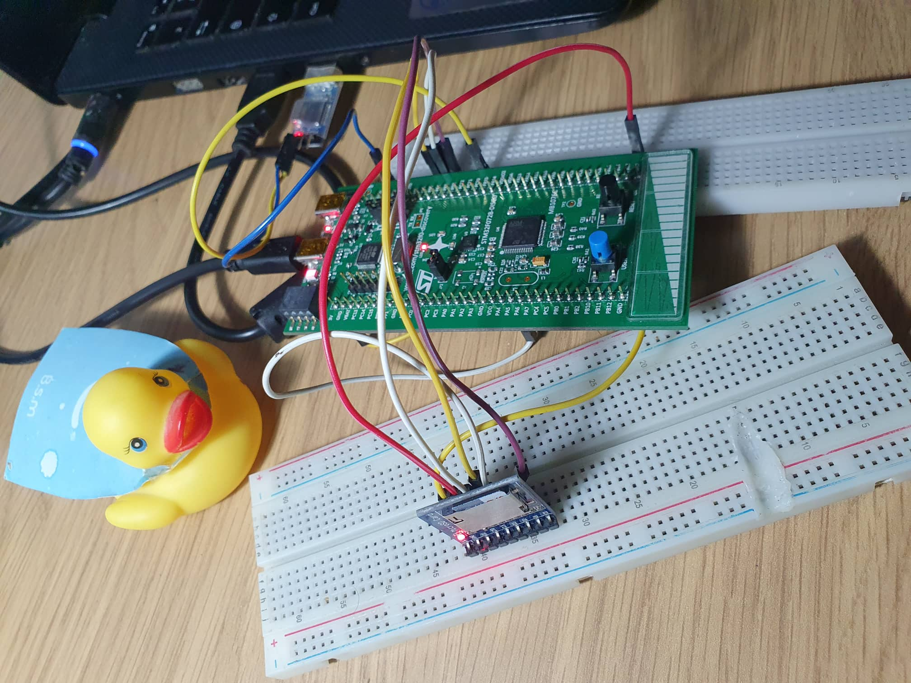
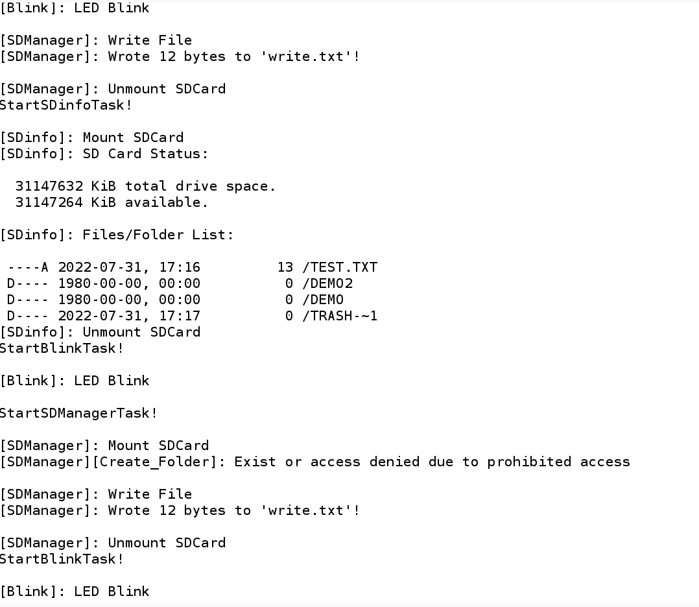

# FreeRTOS & FatFs in Stm32 (Arm® Cortex®-M0) 

This project is designed as an example of a STM32CubeIDE-generated system with FreeRTOS multitask feautures and FatFs File System for controlling an SPI-connected MMC/SD memory card  .

For more information you can take a look here

- [FreeRTOS](https://www.freertos.org/)
- [FatFs](http://elm-chan.org/fsw/ff/00index_e.html)


## Features

- MultiTask 
- Mutexes & Thread Safety
- CMSIS-RTOS API Version 1 
- FatFs Application Interface 
    - Memory state
    - Manipulation of folders/files
    - Error Messages


## Overview

I was created 3 task with different priority and sizes with safe access via mutex to SD card.

- Blink: Simple Task for Blinking LED 
- SDinfo: Give infomation about SD Card and files
    - Usage Memory, Free Space, List of Files/Folders with details (Date, Type, Path, Name)
- SDManager: Create, Read, Write, Find Folders/Files


## Note

This example was built based on Tutorial created by [@kiwih](https://github.com/kiwih)
For more information [Tutorial: An SD card over SPI](https://01001000.xyz/2020-08-09-Tutorial-STM32CubeIDE-SD-card/).

Original code FatFs without FreeRTOS :  [Cubeide-sd-card](https://github.com/kiwih/cubeide-sd-card)

## Installation

This example was created using Stm32f072 discovery kit + Waveshare SD card module
In addition, I used Converter USB-UART with PL2303HX to read UART messages



## Connections

Since the SPI2 is connected to ST MEMS motion senso ( One of the properties [32F072BDISCOVERY](https://www.st.com/en/evaluation-tools/32f072bdiscovery.html#overview))
So I used SPI1 and defined SD_SPI_HANDLE to SPI1
```sh
#define SD_SPI_HANDLE hspi1
```

Finally, In table form the connections are as follows:

| SD Adapter side	 | Stm32f072 side |
| ------ | ------ |
| MISO | PB4 |
| MOSI | PB5 |
| SCLK | PA5 |
| CS | PB3 |
| 3V | 3.3V |
| GND | GND |

## Testing




## License

Creative Commons Zero v1.0 Universal